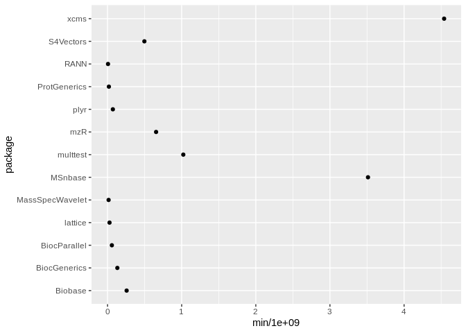
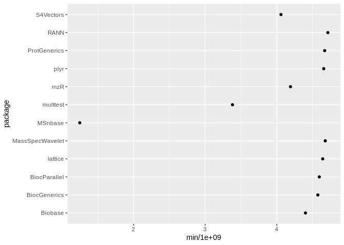

<!-- README.md is generated from README.Rmd. Please edit that file -->

[](https://travis-ci.org/rmflight/dependencyTimings)

# dependencyTimings

The goal of `dependencyTimings` is to help developers determine if any
of the R packages their package depends on make loading their package
slow.

To accompmlish this, it uses independent R sessions from the `future`
package to time how long it takes to load each of the packages listed in
the `Imports` and `Depends` fields of the package in question. Although
it will take a long time because it only uses a single core at a time
(the only way I could get reliable timings), the times seem to be
reliable.

## Installation

Currently, `dependencyTimings` only exists on Github, so install it
with:

``` r
remotes::install_github("rmflight/dependencyTimings")
```

## Example

For example, lets look at a Bioconductor package I’ve seen take a long
time to load, `xcms`.

``` r
# not run
library(furrr)
plan(multiprocess)
library(dependencyTimings)
xcms_time = dependency_timings("xcms")
```

The package provides two types of timings, the time required for the
dependency to load (type = `pkg`), and then the time required for the
package to load after the dependency (type = `after`).

``` r
data(xcms_time)
knitr::kable(head(dplyr::select(xcms_time, -timings)))
```

| package      |        med |        min |        max | type  | which |
| :----------- | ---------: | ---------: | ---------: | :---- | :---- |
| xcms         | 4976578976 | 4798341210 | 5014781815 | pkg   | self  |
| xcms         |     117089 |     113915 |     145700 | after | self  |
| mzR          |  614742149 |  610052770 |  621293289 | pkg   | other |
| mzR          | 4169187196 | 4074939230 | 4356948417 | after | other |
| BiocGenerics |  128901730 |  125557062 |  130745128 | pkg   | other |
| BiocGenerics | 4652948336 | 4604747406 | 4785330220 | after | other |

We can use the `pkg` entries to see which dependencies actually take a
long time to load, possibly contributing to the long load time of our
package in question.

``` r
library(ggplot2)
ggplot(dplyr::filter(xcms_time, type %in% "pkg"), 
       aes(x = min / 1e9, y = package)) + 
  geom_point()
```



From this plot, we can see that `MSnbase` looks like it is taking the
longest to load outside of `xcms` itself.

We can use the `after` entries to see which dependencies after loading
have the smallest time to load our package in question, which implies
they may be the culprit causing long load times.

``` r
ggplot(dplyr::filter(xcms_time, type %in% "after", which %in% "other"),
       aes(x = min / 1e9, y = package)) +
  geom_point()
```


